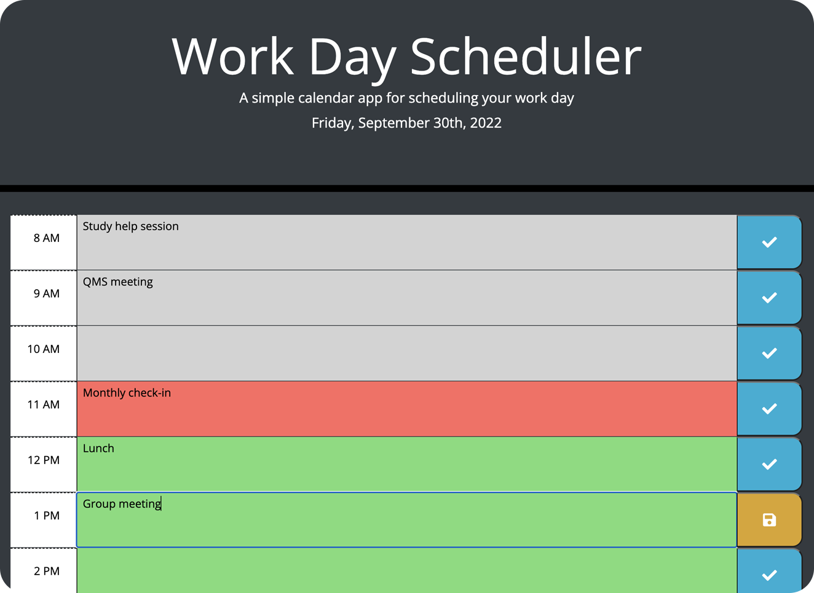

# Work Day Scheduler

## Description

A simple calendar website that displays the current date and provides an interface for a user to enter and save various events on an hourly schedule. The following features are implemented in accordance with the challenge criteria:
- Use of **Moment.js** to obtain and format dates and times on the page.
- Use of **jQuery** to dynamically generate/style page elements and to attach event listeners to interactive elements.
- Use of **Bootstrap** to implement the page layout.
- Use of **localStorage** to save calendar data in a persistent fashion.
- Dynamic highlighting of the calendar table based on the current time of day when the page is loaded.

Extra features included for completeness and UX considerations include:
- Visual cue on save buttons that alerts the user when a time slot has been edited.
   

   

## Usage

The page can be viewed [here](https://binderb.github.io/work-day-scheduler/) on GitHub Pages. The page will display the current weekday/date in its header, as well as an an hourly time schedule. The user can add/edit the calendar by clicking on the time slots in the center of the page. The time slots are highlighted in different colors depending on the time of day: grey for past hours, red for the current hour, and green for future hours. The button to the right of each entry will change its color and icon to indicate when edits have been made, and clicking the button will save the user's edits to the corresponding entry in their browser's local storage.

## Credits

Starter code, including initial HTML/CSS files for the page, was provided by the UofM Coding Bootcamp (Trilogy Education Services); all other code (all JavaScript, and edits to the starter code) was written by the developer.

## License

Please refer to the LICENSE in the repo.
